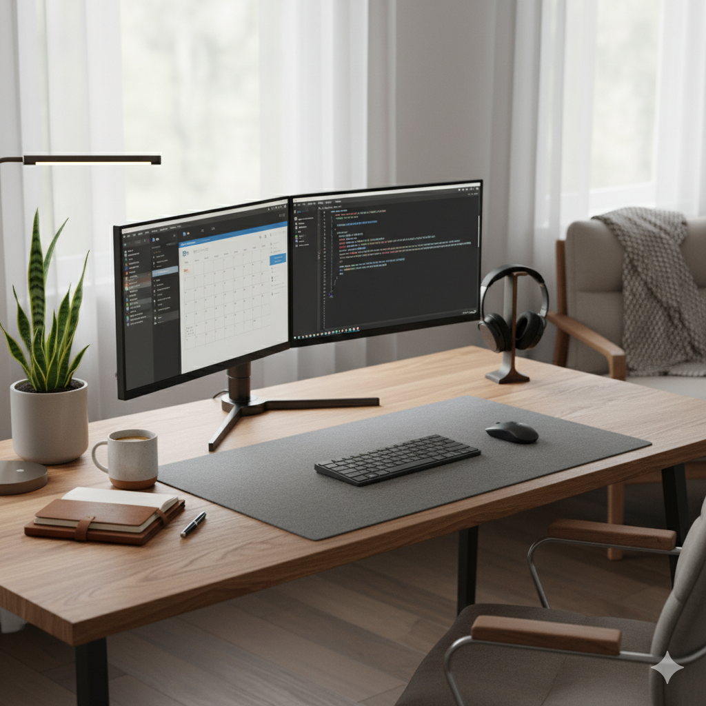

Rozdział 2: Organizacja przestrzeni
==================================================

Fizyczne granice w niefizycznym biurze
--------------------------------------

Stworzenie dedykowanej przestrzeni do pracy jest absolutnym fundamentem efektywnego home office. Nie każdy dysponuje osobnym gabinetem, jednak wydzielenie choćby fragmentu pokoju, który służy wyłącznie celom zawodowym, ma kluczowe znaczenie psychologiczne. Pozwala to na mentalne "wejście do biura" rano i "wyjście z niego" po południu.

Praca z kanapy czy łóżka, choć początkowo kusząca, na dłuższą metę jest zabójcza dla kręgosłupa i produktywności. Mózg kojarzy te miejsca z relaksem i snem; zmuszanie go do intensywnego wysiłku intelektualnego w tych strefach prowadzi do dysonansu, który obniża jakość zarówno pracy, jak i późniejszego wypoczynku.

Ergonomia: Inwestycja w zdrowie
-------------------------------

Ergonomia to nie luksus, to konieczność. Spędzając przed komputerem 8 godzin dziennie, narażamy nasze ciało na ogromne obciążenia. Podstawowe wyposażenie powinno obejmować krzesło z regulowanym podparciem odcinka lędźwiowego oraz monitor ustawiony na odpowiedniej wysokości (górna krawędź ekranu powinna znajdować się na linii wzroku lub nieco poniżej).

Warto zadbać również o odpowiednie oświetlenie. Najlepsze jest światło dzienne, padające z boku, aby nie tworzyć refleksów na monitorze. Po zmroku należy unikać pracy wyłącznie przy świetle monitora – prowadzi to do szybkiego zmęczenia oczu.

   *Rys. 1. Przykład ergonomicznie zorganizowanego stanowiska pracy, które sprzyja skupieniu.*

Minimalizm i porządek
---------------------

Otoczenie ma bezpośredni wpływ na naszą zdolność koncentracji. Zagracone biurko często przekłada się na "zagracony" umysł. Warto wdrożyć zasadę "czystego biurka" na koniec każdego dnia pracy. Uporządkowanie dokumentów, odniesienie kubków po kawie i przygotowanie notatek na kolejny dzień zajmuje zaledwie 5 minut, a pozwala rozpocząć kolejny poranek z poczuciem kontroli i świeżości. Rośliny doniczkowe (widoczne na powyższym zdjęciu) nie tylko produkują tlen, ale również udowodniono, że ich obecność obniża poziom stresu.
